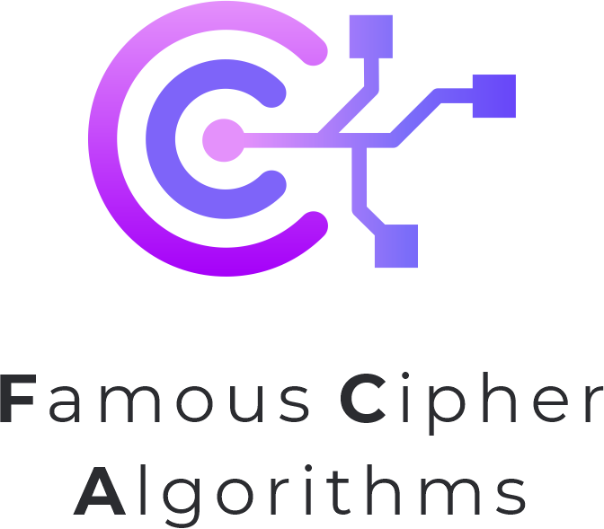

# Famous Cipher Algorithms


<a class="reference external image-reference" href="https://pypi.python.org/pypi/FamousCipherAlgorithms"></a>

<div class="sidebar-logo-container">
  
  
</div>

FamousCipherAlgorithms is a Python package that implements several classic cipher algorithms. The package currently includes the following algorithms:
- Affine
- Shift
- Hill
- Permutation
- Playfair
- Vigenere
- Rail Fence

## Installation
The package can be easily installed using pip:
```
pip install FamousCipherAlgorithms
```

## Usage
You can import `FamousCipherAlgorithms` in two ways:
1. Import entire package
    ```python
    import FamousCipherAlgorithms as FCA
    ```
2. Import specific algorithms
    ```python
    from FamousCipherAlgorithms import AffineCipher, ShiftCipher
    ```

## Documentation
Detailed documentation for each algorithm is available in the <a href="https://famous-cipher-algorithm.readthedocs.io/en/latest/index.html"> document</a>.

## Contributing
Contributions are always welcome! If you have any suggestions, bug reports, or pull requests, please feel free to open an issue on GitHub.

## License
This package is licensed under the MIT license. See the <a href="https://github.com/MobinNesari81/Famous-Cipher-Algorithms/blob/main/LICENSE">LICENSE</a> file for more details.

Copyright © 2023, <a href="https://www.linkedin.com/in/mobin-nesari/">Mobin Nesari</a> & <a href="https://www.linkedin.com/in/mohammad-mahdi-begmaz-69665a243/">Mohammad Mehdi Begmaz</a>

```{include} ../README.md
:start-after: <!-- start elevator-pitch -->
:end-before: <!-- end elevator-pitch -->
```

```{toctree}
:hidden:
quickstart
```

```{toctree}
:caption: Methods
:hidden:
Affine
Hill
Permutation
Shift
Vigenere
Playfair
RailFenceCipher
```

```{toctree}
:caption: Development
:hidden:
contributing/index
license
```
